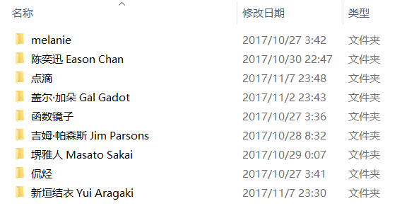
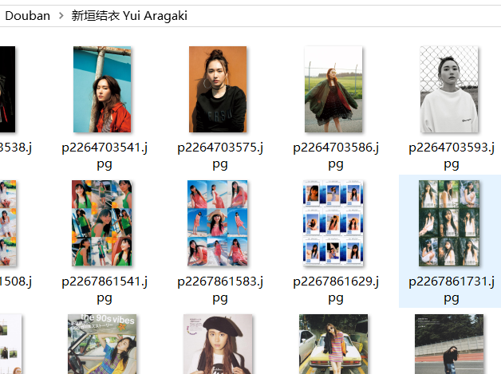

# get_doubancelebrity

> - Two gogerious ladies inspired me to make this tiny project.
> - I made two part of them: one is for personal Douban users' requests, initiated as the basic version. The other one is to seek general celebries, such as Aragaki Yui that I have just mentioned her. (1/2) :)
>- THIS IS MY FIRST PYTHON PROJECT WITH ORIGINAL THOUGHTS.
> -  There will be an important function to fulfill my <Data Analyst> style, also bugs to fix and revise codes to be pythonic.

- 『get_doubanuser.py』: an original version, it may have many redundant codes, can only work if you input an acurate personal ID.

- 『get_doubancelebrity.py』: trying to make it better.

- 『get_doubancelebrity -V1.2版.exe』: you are welcome to download and test it on your computer, do not foget to issue if you find bugs. XieXie!

# 自动爬取并下载豆瓣相册的照片
- 一个简单的爬虫脚本
- 通过姓名检索，可爬取豆瓣用户(get_doubanuser.py)或者明星(get_doubancelebrity.py)的照片，并下载至本地同目录Douban文件夹下
- 内置使用说明。
（写于2017年的旧作，目前可能存在bug）

 

